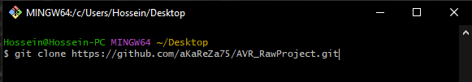
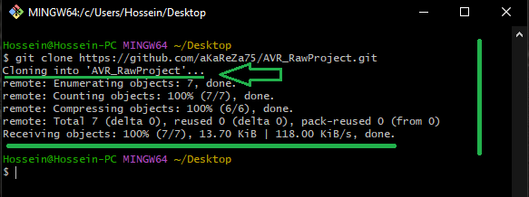
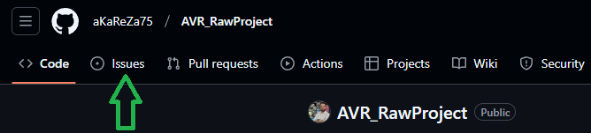
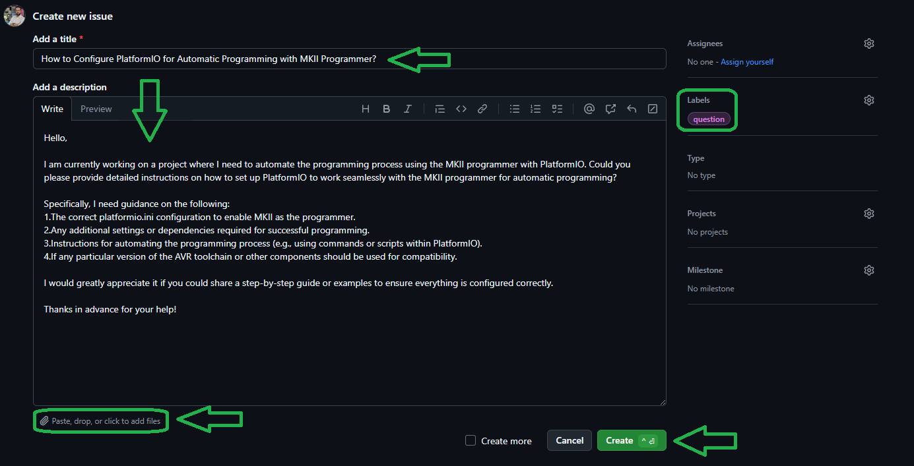

# AVR RawProject
This repository contains the initial setup files for a new AVR project in PlatformIO and VSCode. With these ready-to-use files, you can easily get started with AVR programming by simply copying and pasting them into your PlatformIO workspace. The repository is designed to provide a quick and simple setup to save you time and effort when starting new projects.

<table>
  <tr>
  <td valign="top">
  
  > [!TIP]  
  > If you're looking to better understand how to navigate and use my GitHub repositories — including exploring their structure, downloading or cloning projects, submitting issues, and asking questions,  
  > everything you need is clearly explained in this video:  
  > [aKaReZa 95 - Programming, Git - PART B](https://youtu.be/zYiUItVFRqQ)  
  > Make sure to check it out!
  
  </td>
    <td width="360" valign="middle" style="padding: 0;">
      <a href="https://youtu.be/zYiUItVFRqQ">
       
      </a>
    </td>

  </td>
  </tr>
  <tr>
  <td colspan="2">

  > [!CAUTION]
  > It is absolutely critical that you carefully read every single word of this document, line by line, to ensure you don't miss any details. Nothing can be overlooked.
      
  </td>
  </tr>  
</table>

**Default Configuration Settings**    

| **Setting**                      | **Default Value**                |
|----------------------------------|----------------------------------|
| Programmer                       | Onboard USB to TTL Converter     |
| Oscillator Frequency             | 16 MHz                           |
| Serial Port                      | COM5 (depends on system)         |
| Serial Baud Rate                 | 115200 bps                       |

> [!IMPORTANT]
The upload_port parameter in your platformio.ini file must match the COM port identified by your system for proper communication.   
For example, if your system assigns COM5 to the device, make sure the upload_port = COM5 line is correctly set.

## Programming Methode
By default, this project is programmed through the **onboard USB to TTL converter** on the board. Simply connect the board to your computer via USB, and the programming process will proceed without the need for an external programmer.

**Using an External Programmer (USBasp or MKII)**:  
If you need to use an external programmer (like **USBasp** or **MKII**), you'll need to modify the `platformio.ini` file accordingly. Add the following lines at the end of the `platformio.ini` file:

- **For USBasp**:
    ```
    upload_protocol = custom
    upload_port = usb 
    upload_flags = 
      -C
        $PROJECT_PACKAGES_DIR/tool-avrdude/avrdude.conf 
      -p
        $BOARD_MCU
      -P 
        $UPLOAD_PORT
      -c
        usbasp
      -B
        1 ; Speed(750KHz) for USBASP
      -u 
        -Uefuse:w:0xFF:m ; Extended fuseBit
        -Uhfuse:w:0xD7:m ; High fuseBit
        -Ulfuse:w:0xE2:m ; Low fuseBit
        -Ulock:w:0xFF:m  ; lockBit
    upload_command = avrdude $UPLOAD_FLAGS -U flash:w:$SOURCE:I
    ```

- **For MKII**:
    ```
    upload_protocol = custom
    upload_port = usb 
    upload_flags = 
      -C
        $PROJECT_PACKAGES_DIR/tool-avrdude/avrdude.conf 
      -p
        $BOARD_MCU
      -P 
        $UPLOAD_PORT
      -c
        avrispmkII
      -B
        1 ; Speed(1MHz) for USBASP
      -u 
        -Uefuse:w:0xFF:m ; Extended fuseBit
        -Uhfuse:w:0xD7:m ; High fuseBit
        -Ulfuse:w:0xE2:m ; Low fuseBit
        -Ulock:w:0xFF:m  ; lockBit
        upload_command = avrdude $UPLOAD_FLAGS -U flash:w:$SOURCE:I
    ```
 After adding these settings, PlatformIO will use the specified external programmer to upload the firmware to the board.

**Changing Fuse Bits**:  
To modify the fuse bits for the microcontroller, you will need to update the following lines in the `platformio.ini` file under the `build_flags` section:

- `-Uefuse:w:0xFF:m`  ; Extended fuse bit
- `-Uhfuse:w:0xD7:m`  ; High fuse bit
- `-Ulfuse:w:0xE2:m`  ; Low fuse bit
- `-Ulock:w:0xFF:m`   ; Lock bit

These settings allow you to configure the fuse bits for your microcontroller directly from PlatformIO during the upload process. Adjust the fuse values based on your specific requirements (e.g., clock settings, bootloader configuration, etc.).

- [Understanding Fuse Bits and How to Configure Them](https://github.com/aKaReZa75/AVR/blob/main/fuseBits.md)
  ---  
  This document provides a **detailed explanation of fuse bits** in AVR microcontrollers and how to configure them for different settings.   
  Learn about the role of **extended, high, low, and lock fuse bits** in customizing the behavior of your AVR microcontroller, including settings for clock configuration, bootloader, and more.   

> [!NOTE]
To enable support for decimal numbers in PlatformIO, the following flags need to be added to the `platformio.ini` file:
   ```
   build_flags = -Wl,-u,vfprintf -lprintf_flt -lm
   ```
These flags allow the use of functions like `sprintf` to handle floating-point numbers correctly. In this project, these flags are already included by default, ensuring that decimal numbers are properly supported in functions like `sprintf`.

# Resources
- [VSCode and PlatformIO Setup Guide](https://youtu.be/pgIYUdyb7S8)  
  ---  
  This video offers a **step-by-step guide on installing and setting up VSCode** along with **PlatformIO** for embedded development. Learn how to configure VSCode as an efficient Integrated Development Environment (IDE) for programming AVR and other microcontrollers.   
  The guide covers **PlatformIO installation**, **toolchain setup**, **project creation**, and **debugging setup**. Whether you are new to VSCode or an experienced developer looking to integrate PlatformIO into your workflow, this resource will ensure a smooth setup for all your embedded development projects.

- [bitWise Macros](https://github.com/aKaReZa75/AVR/blob/main/Macros.md) 
  ---  
   There is a header file named **`aKaReZa.h`** in the project that contains a set of these macros. In this document, we explain the usage of each macro from the header, with relevant examples to show their application.
  
- [AVR Microcontroller Training](https://github.com/aKaReZa75/AVR)  
  ---  
  This repository provides a **comprehensive guide to AVR microcontroller programming**, covering everything from the fundamentals to advanced firmware development. Learn about **AVR architecture, peripheral interfacing, timers, interrupts, communication protocols**, and more through hands-on projects and real-world examples. Whether you're just starting or looking to refine your embedded programming skills, this resource will help you master AVR development.

- [eBoard for ATMEGA328](https://github.com/aKaReZa75/eBoard_ATMEGA328)  
  ---  
  This repository covers the **design, assembly, and testing** of an educational header board based on the ATMEGA328 AVR microcontroller. Fully **compatible with the Arduino UNO**, this board serves as a hands-on learning tool for AVR development. It includes detailed schematics, PCB layout files to help users explore microcontroller fundamentals, pin configurations, and peripheral interfacing in a practical, project-based format.


# 💻 How to Use Git and GitHub
To access the repository files and save them on your computer, there are two methods available:
1. **Using Git Bash and Cloning the Repository**
   - This method is more suitable for advanced users and those familiar with command-line tools.
   - By using this method, you can easily receive updates for the repository.

2. **Downloading the Repository as a ZIP file**
   - This method is simpler and suitable for users who are not comfortable with command-line tools.
   - Note that with this method, you will not automatically receive updates for the repository and will need to manually download any new updates.

## Clone using the URL.
First, open **Git Bash** :
-  Open the folder in **File Explorer** where you want the library to be stored.
-  **Right-click** inside the folder and select the option **"Open Git Bash here"** to open **Git Bash** in that directory.


> [!NOTE] 
> If you do not see the "Open Git Bash here" option, it means that Git is not installed on your system.  
> You can download and install Git from [this link](https://git-scm.com/downloads).  
> For a tutorial on how to install and use Git, check out [this video](https://youtu.be/BsykgHpmUt8).
  
-  Once **Git Bash** is open, run the following command to clone the repository:

 ```bash
git clone https://github.com/aKaReZa75/AVR_RawProject.git
```
- You can copy the above command by either:
- Clicking on the **Copy** button on the right of the command.
- Or select the command text manually and press **Ctrl + C** to copy.
- To paste the command into your **Git Bash** terminal, use **Shift + Insert**.



- Then, press Enter to start the cloning operation and wait for the success message to appear.



> [!IMPORTANT]
> Please keep in mind that the numbers displayed in the image might vary when you perform the same actions.  
> This is because repositories are continuously being updated and expanded. Nevertheless, the overall process remains unchanged.

> [!NOTE]
> Advantage of Cloning the Repository:  
> - **Receiving Updates:** By cloning the repository, you can easily and automatically receive new updates.  
> - **Version Control:** Using Git allows you to track changes and revert to previous versions.  
> - **Team Collaboration:** If you are working on a project with a team, you can easily sync changes from team members and collaborate more efficiently.  

## Download Zip
If you prefer not to use Git Bash or the command line, you can download the repository directly from GitHub as a ZIP file.  
Follow these steps:  
1. Navigate to the GitHub repository page and Locate the Code button:
   - On the main page of the repository, you will see a green Code button near the top right corner.

2. Download the repository:
   - Click the Code button to open a dropdown menu.
   - Select Download ZIP from the menu.

    

3. Save the ZIP file:
   - Choose a location on your computer to save the ZIP file and click Save.

4. Extract the ZIP file:
   - Navigate to the folder where you saved the ZIP file.
   - Right-click on the ZIP file and select Extract All... (Windows) or use your preferred extraction tool.
   - Choose a destination folder and extract the contents.

5. Access the repository:
   - Once extracted, you can access the repository files in the destination folder.

> [!IMPORTANT]
> - No Updates: Keep in mind that downloading the repository as a ZIP file does not allow you to receive updates.    
>   If the repository is updated, you will need to download it again manually.  
> - Ease of Use: This method is simpler and suitable for users who are not comfortable with Git or command-line tools.

# 📝 How to Ask Questions
If you have any questions or issues, you can raise them through the **"Issues"** section of this repository. Here's how you can do it:  

1. Navigate to the **"Issues"** tab at the top of the repository page.  

  

2. Click on the **"New Issue"** button.  
   
  

3. In the **Title** field, write a short summary of your issue or question.  

4. In the "Description" field, detail your question or issue as thoroughly as possible. You can use text formatting, attach files, and assign the issue to someone if needed. You can also use text formatting (like bullet points or code snippets) for better readability.  

5. Optionally, you can add **labels**, **type**, **projects**, or **milestones** to your issue for better categorization.  

6. Click on the **"Submit new issue"** button to post your question or issue.
   
  

I will review and respond to your issue as soon as possible. Your participation helps improve the repository for everyone!  

> [!TIP]
> - Before creating a new issue, please check the **"Closed"** section to see if your question has already been answered.  
>     
> - Write your question clearly and respectfully to ensure a faster and better response.  
> - While the examples provided above are in English, feel free to ask your questions in **Persian (فارسی)** as well.  
> - There is no difference in how they will be handled!  

> [!NOTE]
> Pages and interfaces may change over time, but the steps to create an issue generally remain the same.

# 🤝 Contributing to the Repository
To contribute to this repository, please follow these steps:
1. **Fork the Repository**  
2. **Clone the Forked Repository**  
3. **Create a New Branch**  
4. **Make Your Changes**  
5. **Commit Your Changes**  
6. **Push Your Changes to Your Forked Repository**  
7. **Submit a Pull Request (PR)**  

> [!NOTE]
> Please ensure your pull request includes a clear description of the changes you’ve made.
> Once submitted, I will review your contribution and provide feedback if necessary.

# 🌟 Support Me
If you found this repository useful:
- Subscribe to my [YouTube Channel](https://www.youtube.com/@aKaReZa75).
- Share this repository with others.
- Give this repository and my other repositories a star.
- Follow my [GitHub account](https://github.com/aKaReZa75).

# 📜 License
This project is licensed under the GPL-3.0 License. This license grants you the freedom to use, modify, and distribute the project as long as you:
- Credit the original authors: Give proper attribution to the original creators.
- Disclose source code: If you distribute a modified version, you must make the source code available under the same GPL license.
- Maintain the same license: When you distribute derivative works, they must be licensed under the GPL-3.0 too.
- Feel free to use it in your projects, but make sure to comply with the terms of this license.
  
# ✉️ Contact Me
Feel free to reach out to me through any of the following platforms:
- 📧 [Email: aKaReZa75@gmail.com](mailto:aKaReZa75@gmail.com)
- 🎥 [YouTube: @aKaReZa75](https://www.youtube.com/@aKaReZa75)
- 💼 [LinkedIn: @akareza75](https://www.linkedin.com/in/akareza75)
